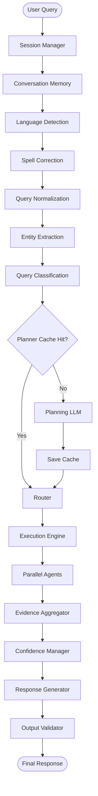

# Supervisor Agent Execution Graph

The following Mermaid flowchart represents the verified production execution graph of the Supervisor Agent:

```mermaid
graph TD
    User([User Query]) --> Session[Session Manager]
    Session --> Memory[Conversation Memory]
    Memory --> Lang[Language Detection]
    Lang --> Spell[Spell Correction]
    Spell --> Norm[Query Normalization]
    Norm --> Entity[Entity Extraction]
    Entity --> Class[Query Classification]
    Class --> Cache{Planner Cache Hit?}
    Cache -- Yes --> Route[Router]
    Cache -- No --> LLM[Planning LLM]
    LLM --> CacheSave[Save Cache]
    CacheSave --> Route
    Route --> Engine[Execution Engine]
    Engine --> Agents[Parallel Agents]
    Agents --> Collate[Evidence Aggregator]
    Collate --> Conf[Confidence Manager]
    Conf --> Gen[Response Generator]
    Gen --> Audit[Output Validator]
    Audit --> Return([Final Response])
```
